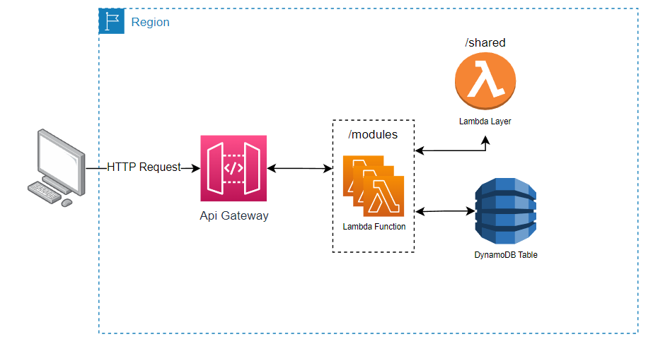

# Clean Arch template 🌡🍽

Template para repositórios de microsserviços baseado em Clean Architecture

## O Projeto 📽

### Introdução e Objetivos ⁉

O principal objetivo é fornecer um template para repositórios que possa ser utilizado como ponto de partida para novos projetos. Esta arquitetura é baseada na Clean Architecture e foi fundamentada em vários outros projetos, livros e artigos que foram compilados pelos estudantes do Instituto Mauá de Tecnologia, do grupo acadêmico Dev. Community Mauá.

### Motivos 1️⃣3️⃣

O projeto visa ajudar desenvolvedores a iniciarem novos projetos com uma boa arquitetura e com uma boa estrutura, de forma que qualquer pessoa possa criar boas aplicações.

### Clean Architecture 🧼🏰

O propósito do projeto é aprender e criar uma Clean Architecture para microsserviços sem estado com AWS Lambda, que é uma forma de estruturar o código em camadas, cada uma com uma responsabilidade específica. Esta arquitetura é baseada nos princípios SOLID e em livros como "Clean Architecture: A Craftsman's Guide to Software Structure and Design" de Robert C. Martin.

Também tentamos explicar para novos programadores da maneira mais intuitiva possível e você pode ver a explicação aqui: [Clean Architecture Figma](https://www.figma.com/file/CmfQcH2xbZyIszPX0iOxPp/Clean-Arch---HackaBeckas?node-id=0%3A1&t=B38vNfX3VSv6qtU7-1)

### Estrutura de Pastas 🎄🌴🌲🌳

Nossa estrutura de pastas foi desenvolvida especialmente para os nossos projetos.


```bash
├── iac
├── src
│   ├── modules
│   │   ├── create_user
│   │   │   └── app
│   │   ├── delete_user
│   │   │   └── app
│   │   ├── get_user
│   │   │   └── app
│   │   └── update_user
│   │       └── app
│   └── shared
│       ├── domain
│       │   ├── entities
│       │   ├── enums
│       │   └── repositories
│       ├── helpers
│       │   ├── enum
│       │   ├── errors
│       │   ├── functions
│       │   └── http
│       └── infra
│           ├── dto
│           ├── external
│           └── repositories
└── tests
    ├── modules
    │   ├── create_user
    │   │   └── app
    │   ├── delete_user
    │   │   └── app
    │   ├── get_user
    │   │   └── app
    │   └── update_user
    │       └── app
    └── shared
        ├── domain
        │   └── entities
        ├── helpers
        └── infra

```


## Diagrama da Arquitetura do Software 🏗



## Instalação 👩‍💻

Clone o repositório usando o template

### Crie um ambiente virtual python (apenas na primeira vez)

###### Windows

    python -m venv venv

### Ative o ambiente virtual python

###### Windows:

    venv\Scripts\activate

### Instale as dependências

    pip install -r requirements-dev.txt
    pip install -r requirements.txt

### Rode os testes

    pytest

### Para rodar localmente configure o arquivo .env

    STAGE=TEST

# Colaboradores 🤝

<table>
  <tr>
    <td align="center">
      <a href="#">
        <br>
        <sub>
          <p><b><i>Alessandro Lima:</i></b> <a href="https://github.com/alexZ7000"><i>alexZ7000</i></a>🏆</p>
        </sub>
      </a>
    </td>
    <td align="center">
      <a href="#">
        <br>
        <sub>
          <p><b><i>Nicole Mascaretti:</i></b> <a href="https://github.com/NicoleMascaretti"><i>NicoleMascaretti</i></a>🏆</p>
        </sub>
      </a>
    </td>
    <td align="center">
      <a href="#">
        <br>
        <sub>
          <p><b><i>Pedro Wilian:</i></b> <a href="https://github.com/pedrowilian"><i>pedrowilian</i></a>🏆</p>
        </sub>
      </a>
    </td>
  </tr>
</table>
